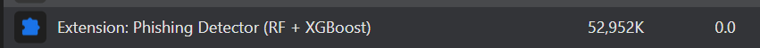
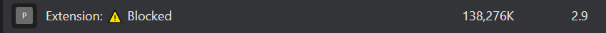
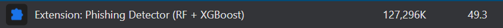
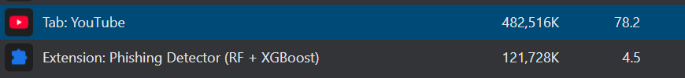
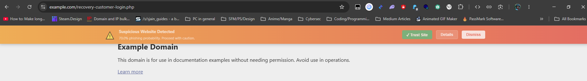

# Panduan Pengujian Ekstensi — P-01 / P-02 / P-03 / Uji Fungsional

> Sesi: 2026-09-21 · Ekstensi: **v3.2** (model tetap v3.1: RF `625c9333…`, XGB `daa8c8d4…`)
> Prasyarat: ekstensi sudah di-*reload* di `chrome://extensions` (tombol ⟳) setelah commit terakhir.
> ID ekstensi: `jabeplfgcjflfbdbiflpcclngefpkbhm` — cek di `chrome://extensions` kalau berbeda.

---

## P-01 — Latensi scan di browser (otomatis)

Halaman bench memanggil jalur `scan` yang sama dengan popup, untuk 1.000 URL
(`bench_urls.json`, identik dengan benchmark Python: common split, seed 42).

1. **Reload ekstensi** di `chrome://extensions`. Jangan buka popup dulu.
2. Buka tab baru: `chrome-extension://<ID>/bench.html`
3. Pastikan "URLs per model" = `1000`.
4. Klik **Run both** (RF lalu XGB). Progress dan ringkasan tampil di halaman.
   Perkiraan: beberapa menit untuk 2 × 1.000 scan.
5. Setelah status **Finished**, klik **Download JSON**.
   File `bench_browser_v3.2_<timestamp>.json` tersimpan di folder **Downloads**.
6. Beri tahu asisten — file akan diambil langsung dari `/mnt/c/Users/Enzo/Downloads`.

Catatan penting:
- **Jangan buka DevTools service worker sebelum run** (mempertahankan worker tetap hidup → angka init model tidak cold).
- Angka `Init (ms)` per model = muat ONNX pertama kali (cold per model). Model pertama juga termasuk startup WASM.
- Kalau ada error beruntun, run berhenti otomatis dan error tercatat di JSON.

---

## P-02 — Memori ekstensi (Chrome Task Manager)

Persiapan: tutup tab yang tidak perlu, satu jendela Chrome saja.

1. Tekan `Shift+Esc` (Task Manager).
2. Cari baris **"Extension: Phishing Detector"**, lihat kolom *Memory footprint*.
3. Catat kondisi berikut (screenshot tiap kondisi):

| Kondisi | Memori (MB) | Screenshot |
|---|---|---|
| Idle setelah load (popup ditutup, belum scan) | Anehnya, saya tidak bisa melihat penggunaan memorinya di Task Manager; angka penggunaan memori baru muncul setelah saya membuka jendela *pop-up* atau saat sistem mendeteksi situs *phishing*. Saat *pop-up* dibuka, angkanya sempat tinggi di 110 MB, namun kemudian turun dan stabil di angka 52.952 MB. | |
| Setelah scan halaman legitimate (mis. `https://www.youtube.com/`) | 121.728 MB | |
| Setelah scan halaman phishing (dari hasil P-01, URL terpilih) | 138.267 MB | |
| Setelah ganti model RF ⇄ XGB di popup | 127.296 MB | |

Target dari Bab 3: idle **< 50 MB**, peak **< 150 MB**.
Cara scan: buka popup → **Scan Current Tab**.

---

## P-03 — CPU saat scan

1. Masih di Task Manager, kolom *CPU*.
2. Lakukan scan (popup atau buka halaman), amati spike CPU baris ekstensi.
3. Screenshot saat spike tertinggi + catat angkanya.

| Kondisi | CPU (%) | Screenshot |
|---|---|---|
| Idle | 0% |  |
| Saat scan halaman | 4.5% | |

Target: spike **< 30%**.

---

## Uji fungsional halaman blokir (klik)

URL uji aman (domain `example.com`, sengaja memakai token yang diberi bobot
tinggi oleh model; paritas browser = Python 100%):

`https://example.com/recovery-customer-login.php`

Skor terverifikasi: **RF 70,0% (SUSPICIOUS)**, **XGB 99,3% (PHISHING)**.

1. Pilih model **XGBoost** di popup.
2. Buka URL di atas → `blocked.html` harus muncul (High Risk 99,3%).
3. Uji tombol:
   - **Go Back** → kembali.
   - **Continue** → halaman example.com terbuka sekali; buka URL yang sama lagi → diblokir lagi (bypass sekali pakai).
   - **Trust Site** → `example.com` masuk whitelist; **hapus lagi lewat popup setelah selesai**.
4. Alternatif uji tampilan tanpa model:
   `chrome-extension://<ID>/blocked.html?url=https%3A%2F%2Fexample.com&conf=95`

Catatan: kalau situs melakukan redirect, bypass hanya berlaku untuk URL persis yang diblokir
(lihat `docs/extension-known-issues.md`).

---

## Uji banner peringatan (skor 60–80%)

URL uji: `https://example.com/recovery-customer-login.php` — pakai model **Random Forest**.

| Model | Skor | Banner muncul? | Details/Dismiss/Trust berfungsi? |
|---|---|---|---|
| Random Forest | 70,0% (SUSPICIOUS) | Yes. | Berfungsi |

Langkah: pilih **Random Forest** di popup → kunjungi URL → banner oranye
"70.0% phishing probability" muncul di atas halaman.

Catatan: XGB memblokir URL ini (99,3%) — jangan pakai XGB untuk uji banner.
Trust Site akan menambah `example.com` ke whitelist; hapus setelah uji.

---

## Tangkapan layar popup (tiga verdict)

| Verdict | Model | URL | Harapan |
|---|---|---|---|
| SAFE | RF atau XGB | `https://www.wikipedia.org/` | ✅ SAFE · Low Risk (RF 6,9% / XGB 45,4%) |
| SUSPICIOUS | RF | `https://example.com/recovery-customer-login.php` | ⚠️ SUSPICIOUS · Medium Risk (70,0%) |
| PHISHING | XGB | `https://example.com/recovery-customer-login.php` | 🚨 PHISHING · High Risk (99,3%) |

---

## (Opsional) Latensi navigasi nyata — log service worker

Dilakukan **setelah P-01** (kalau DevTools dibuka lebih dulu, worker tetap hidup dan angka init P-01 tidak cold lagi).

1. `chrome://extensions` → kartu ekstensi → klik **"service worker"** (DevTools terbuka).
2. Kunjungi 5–10 situs (campur legitimate + phishing dari daftar uji).
3. Screenshot baris log `[BG] [RF/XGB] … (X.XXms)`.

---

## Checklist artefak

- [ ] JSON P-01 dari folder Downloads
- [ ] Tabel P-02 terisi + screenshot
- [ ] Tabel P-03 terisi + screenshot
- [ ] Screenshot halaman blokir (klik tombol)
- [ ] Screenshot banner peringatan
- [ ] Screenshot popup SAFE (`Low Risk (x%)`) dan PHISHING (`High Risk (x%)`)
